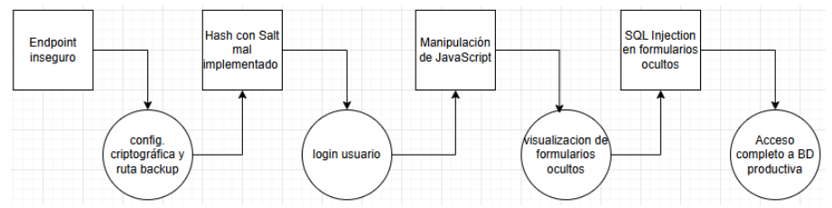

# TP Seguridad en Aplicaciones Web - 2C2025

Aplicación de aula virtual de un centro educativo (similar al campus de la UTN).

Roles que intervienen:
* Estudiantes: Visualizan sus cursos y el material de los mismos.
* Profesores: Cargan alumnos a cursos, junto con el material de los mismos.

## Vulnerailidad 1: Identification & Authentication failures
La aplicación expone accidentalmente un endpoint de debugging sin autenticación (/actuator/env) que devuelve variables de entorno bajo el contenido de un archivo de configuración (application.properties).

En ese archivo aparecen, entre otros, propiedades de configuración criptográfica (algoritmo de hash, salt utilizado) y rutas/URIs a backups de usuarios de estudiantes.

 * http://localhost:8080/actuator/env
 * TODO: Ver URI Backup Usuarios

## Vulnerabilidad 2: Cryptographic Failures
Usando la información divulgada se accede (lectura) a un backup de la base de datos de usuarios y se recuperan usuarios y contraseñas hasheadas.

Habiendo obtenido anteriormente el algoritmo de hash y SALT utilizado, es posible realizar ataques offline (diccionario/fuerza bruta o, en caso de cifrado reversible, descifrado) sobre las credenciales de acceso obtenidas.

Finalmente, se obtiene el texto descifrado y se logra un login exitoso en el sistema.

Valores obtenidos del backup:
* hash = SHA-256
* salt = "unSaltSuperSecreto123"
* usuario: juan.perez | SHA-256(salt + pass) = d7192d9843923c34820751260af75ff744fc296f6c6d41ab1223c3738c57f6e3

* comando fuerza bruta: hashcat -m 1420 -a 0 hashes.txt /ruta/a/wordlists/rockyou.txt -> pass: juan123

## Vulnerailidad 3: Broken access control
El control de visibilidad de secciones sensibles se implementa exclusivamente en el frontend (mediante JavaScript).

El usuario (no profesor) autenticado obtenido anteriormente puede modificar el código html en el cliente para mostrar secciones restringidas y acceder a funcionalidades no autorizadas.

* curso -> f12 -> inspeccionar -> modificar html -> eliminar "hidden" -> recargar página -> acceso a funcionalidades de profesor

## Vulnerabilidad 4: SQL Injections
Se descubre que en los formularios ocultos no se valida/sanea la entrada, permitiendo inyecciones SQL que permiten el acceso a la BD relacional utilizada en producción.

* introducir en el form oculto o cualquier otra cosa a inyectar (o meterlo en sqlmap)
* ' or 1=1 UNION SELECT u.password AS info_combinada FROM usuario u --
* ' or 1=1; INSERT INTO usuario (username, password, role) VALUES ('hola', 'asfsfag', 'admin') --

## Linea de tiempo de vulnerabilidades

